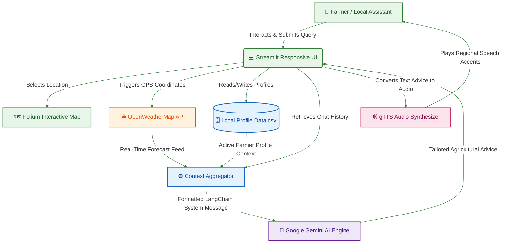

# 🌾 Krishi-Sahayak AI (कृषि-सहायक)

### *AI-Powered Multilingual Hyper-Local Agricultural Advisory Platform*

---

<div align="center">
  
  
  
  
</div>

---

## 🌟 Overview & Competition Context

**Krishi-Sahayak AI** (meaning *Agricultural Assistant* in Sanskrit/Hindi) is a state-of-the-art interactive decision-support system built for the **Google Solution Challenge 2026**. Designed specifically to bridge the digital divide for smallholder farmers in rural India, the platform translates cutting-edge generative artificial intelligence into actionable, localized agricultural intelligence.

According to agricultural statistics, smallholder farmers represent over **80% of India's farming population**, yet they frequently lack access to real-time, language-friendly expert advice regarding volatile weather, soil compatibility, crop selection, and fluctuating market prices. **Krishi-Sahayak AI** directly solves this by providing a hyper-local, multilingual assistant that can be queried naturally in local dialects and can read answers aloud for maximum accessibility.

---

## 🌍 Alignment with United Nations Sustainable Development Goals (SDGs)

This application is built from the ground up to solve critical global issues aligned with the following **UN Sustainable Development Goals**:

| Goal | Application Focus | Impact Mechanics |
| :--- | :--- | :--- |
| **🟢 SDG 2: Zero Hunger** | **Sustainable Agriculture & Higher Yields** | Prevents crop failure by providing real-time soil compatibility checks, pest diagnostics, and climate-resilient farming techniques. |
| **🔵 SDG 10: Reduced Inequalities** | **Accessibility via Local Dialects** | Combats illiteracy and digital exclusion by supporting 6 major regional Indian languages with full **Text-to-Speech (TTS)** voice playbacks. |
| **🟠 SDG 13: Climate Action** | **Weather-Resilient Farm Planning** | Delivers 5-day hyper-local forecasts and dynamically generates climate mitigation strategies based on immediate weather warnings. |

---

## 🚀 Key Capabilities & Features

### 1. 🗺️ Hyper-Local Geospatial Farm Profiling
* **Folium Map Integration:** Farmers or local community workers can pinpoint their farm locations directly on an interactive map.
* **Metadata Persistence:** The application captures the exact GPS coordinates (Latitude & Longitude), soil types, and farm size, storing them locally inside a validated profile system (`Data.csv`).

### 2. 🤖 Gemini 1.5 Flash Contextual Chat
* **LangChain Integration:** The application coordinates human queries with structured system instructions using `ChatGoogleGenerativeAI`.
* **Zero-Syllable Context Blending:** Behind the scenes, the model aggregates farmer-specific metadata (soil type, region) and current local climate metrics before querying the LLM, producing advice tailored specifically to that farm instead of generic tips.

### 3. 🌤️ Real-Time Weather Intelligence
* **OpenWeatherMap Integration:** Leverages coordinates to pull real-time, 5-day / 3-hour local forecasts.
* **Auto-Alert Mechanism:** Triggers active alerts for high temperatures, drought signs, strong winds, and heavy rainfall to prompt early harvest or soil shielding.

### 4. 📈 Dynamic Mandi Market Estimator
* **Predictive Trends:** Provides simulated price forecasting charts per quintal over the upcoming 7 days for key Indian staple crops (Wheat, Rice, Cotton, Tomato, Maize).
* **Financial Decision Support:** Identifies short-term upward or downward market trends to help farmers decide whether to sell immediately or store their harvest.

### 5. 🗣️ High-Fidelity Text-to-Speech (TTS)
* **Accessibility Engine:** Integrated with `gTTS` to translate Gemini's written guidelines into natural spoken audio.
* **Full Multi-Language Playback:** Supports instant audio playback in native accents for all 6 regional languages.

---

## 🌐 Multilingual Matrix

Both the **Streamlit User Interface** and the **Gemini AI response pipeline** natively support complete localized translation for:
* 🇬🇧 **English** (en)
* 🇮🇳 **Hindi** (hi) (हिंदी)
* 🇮🇳 **Tamil** (ta) (தமிழ்)
* 🇮🇳 **Bengali** (bn) (বাংলা)
* 🇮🇳 **Telugu** (te) (తెలుగు)
* 🇮🇳 **Marathi** (mr) (मराठी)

---

## 🎨 System Architecture & Data Flow



---

## ⚙️ Installation & Local Setup

### 📋 Prerequisites
Make sure you have Python **3.9 to 3.11** installed on your operating system.

### 🛠️ Step-by-Step Guide

1. **Clone the Repository:**
   ```bash
   git clone https://github.com/Advait251206/Google-Solution-Challenge.git
   cd Google-Solution-Challenge
   ```

2. **Create and Activate a Virtual Environment:**
   * **Windows:**
     ```powershell
     python -m venv venv
     .\venv\Scripts\Activate.ps1
     ```
   * **macOS/Linux:**
     ```bash
     python3 -m venv venv
     source venv/bin/activate
     ```

3. **Install Core Dependencies:**
   ```bash
   pip install -r requirements.txt
   ```

4. **Setup Environment Variables:**
   Create a `.env` file in the root directory:
   ```env
   # API Keys Configuration
   GEMINI_API_KEY=your_google_gemini_api_key_here
   WEATHER_API_KEY=your_openweathermap_api_key_here

   # Operational Log Settings
   LOG_LEVEL=INFO
   ```

5. **Run the Application:**
   ```bash
   streamlit run app.py
   ```

---

## 📁 Repository Structure

```
├── .gitignore                    # Standardized Python, Streamlit & credential ignore rules
├── README.md                     # Breathtaking competition submission documentation
├── app.py                        # Central Python logic containing UI, translations & API orchestration
├── requirements.txt              # Standardized libraries declaration (langchain, streamlit, folium, etc.)
├── Data.csv                      # Local persistent farmer profile registry (Generated on runtime)
└── Log.csv                       # Historical QA interaction database (Generated on runtime)
```

---

## 🛡️ Security & Best Practices

* **Sensitive Key Exclusions:** Standardized Git tracking ignores local `.env` and all credential-bearing texts.
* **Data Privacy:** Farmer location mapping coordinates and profiles (`Data.csv`) remain completely decentralized and stored locally on the client's host system.